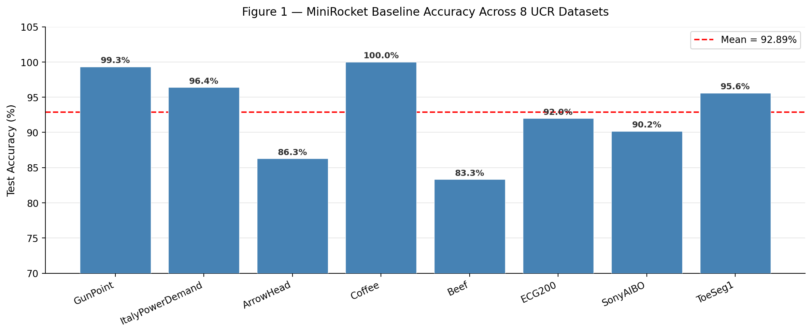
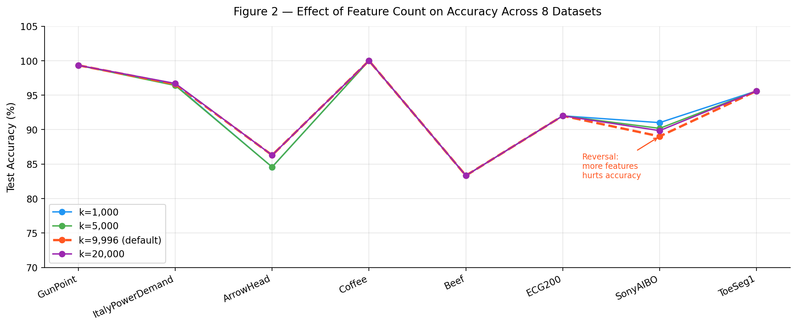
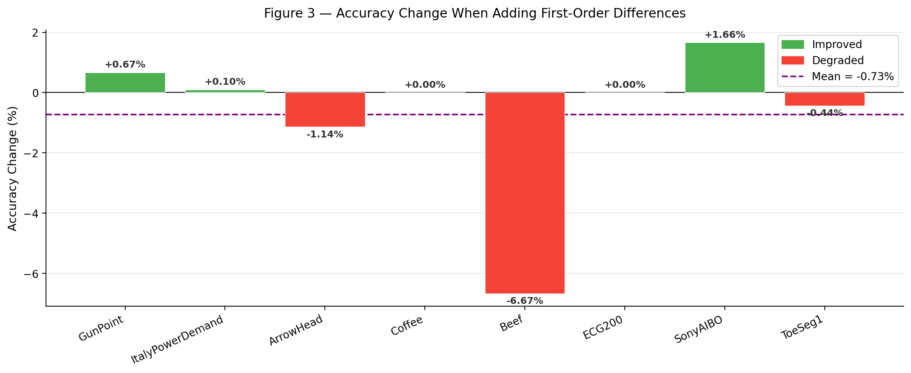
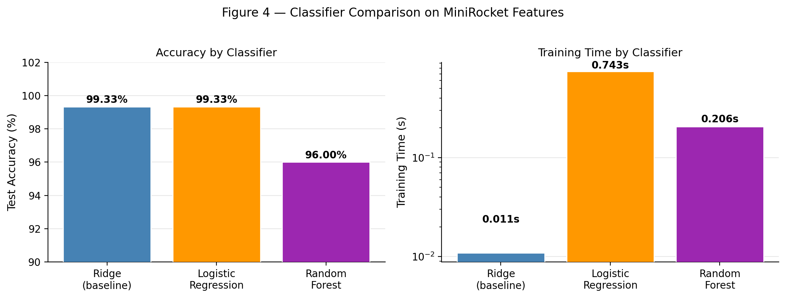

# MiniRocket: Reproduction and Empirical Evaluation

> Reproduction study of **MiniRocket: A Very Fast (Almost) Deterministic 
> Transform for Time Series Classification** (Dempster et al., KDD 2021)  
> Submitted for COMP41850 — AI for Time Series

---

##  Overview

This repository contains a full reproduction and empirical evaluation of 
the MiniRocket algorithm for time series classification. We reproduce the 
paper's core claims on 8 UCR benchmark datasets and conduct three 
ablation experiments to investigate the effect of classifier choice, 
feature count, and first-order differences on classification accuracy.

**Key Results:**
| Metric | Value |
|---|---|
| Mean accuracy (8 datasets) | 92.89% |
| Total pipeline time (8 datasets) | 1.02 seconds |
| Best dataset | Coffee — 100.00% |
| Most interesting finding | SonyAIBO degrades with more features |

---

## 📁 Repository Structure

```
minirocket-reproduction/
│
├── notebook.ipynb                        ← Full Kaggle notebook
│
├── results/
│   ├── results_baseline.csv             ← Baseline accuracy
│   ├── results_classifiers.csv          ← Classifier comparison
│   ├── results_kernel_sizes.csv         ← Kernel size experiment
│   └── results_first_differences.csv   ← First differences
│
├── figures/
│   ├── fig1_baseline.png
│   ├── fig2_kernels.png
│   ├── fig3_differences.png
│   └── fig4_classifiers.png
│
└── README.md
```

##  How to Reproduce

### Option A — Run on Kaggle (Recommended)

1. Go to [Kaggle](https://kaggle.com) and sign in
2. Click **"New Notebook"**  
3. Enable **Internet** in Session options
4. Copy and run each cell from `notebook.ipynb` in order
5. All dependencies install automatically in Cell 0

### Option B — Run Locally

**Requirements:**
```bash
pip install aeon numba scikit-learn numpy pandas matplotlib seaborn
```

**Clone MiniRocket:**
```bash
git clone https://github.com/angus924/minirocket.git
```

**Run the notebook:**
```bash
jupyter notebook notebook.ipynb
```

---

## ⚙️ Environment

| Package | Version |
|---|---|
| Python | 3.10+ |
| Numba | 0.60.0 |
| NumPy | 2.0.2 |
| scikit-learn | 1.6.1 |
| aeon | latest |

---

##  Experiments Summary

### Experiment 1 — Baseline Reproduction
Reproduced MiniRocket on 8 UCR datasets achieving 92.89% mean accuracy 
in 1.02 seconds total — consistent with the paper's speed and accuracy claims.

### Experiment 2 — Classifier Comparison
Ridge regression matched Logistic Regression accuracy (99.33%) at 68× 
lower computational cost. Random Forest was slower and less accurate. 
Validates the original paper's design choice.

### Experiment 3 — Feature Count Ablation
Tested k=1,000 / 5,000 / 9,996 / 20,000 across all 8 datasets.  
**Key finding:** SonyAIBORobotSurface1 accuracy degrades from 91.01% 
at k=1,000 to 89.02% at the default k=9,996 — more features actively 
hurts on this dataset.

### Experiment 4 — First-Order Differences
Adding first-order differences (inspired by MultiRocket) produced a mean 
accuracy **decrease** of 0.73% across 8 datasets. Datasets with small 
training sets (Beef: 30 samples, -6.67%; ArrowHead: 36 samples, -1.14%) 
were most harmed, suggesting feature doubling causes overfitting on 
small training sets.

---

##  Key Figures

### Figure 1 — Baseline Accuracy


### Figure 2 — Effect of Feature Count


### Figure 3 — First Differences Impact


### Figure 4 — Classifier Comparison


---

##  References

- Dempster, A., Schmidt, D.F., Webb, G.I. (2021). MiniRocket: A Very Fast 
  (Almost) Deterministic Transform for Time Series Classification. 
  *KDD 2021*. https://doi.org/10.1145/3447548.3467231

- Tan, C.W., et al. (2022). MultiRocket: Multiple Pooling Operators and 
  Transformations for Fast and Effective Time Series Classification. 
  *Data Mining and Knowledge Discovery*.

- Dempster, A., Petitjean, F., Webb, G.I. (2020). ROCKET: Exceptionally 
  Fast and Accurate Time Series Classification Using Random Convolutional 
  Kernels. *Data Mining and Knowledge Discovery*.

---

##  Report


*Original MiniRocket code by Angus Dempster — 
https://github.com/angus924/minirocket*

## 🔗 Live Notebook

View the full notebook on Kaggle: [MiniRocket Reproduction Notebook](https://www.kaggle.com/code/anjaliiiiisingh/time-series-minirocket-research-py/edit/run/310600120)
